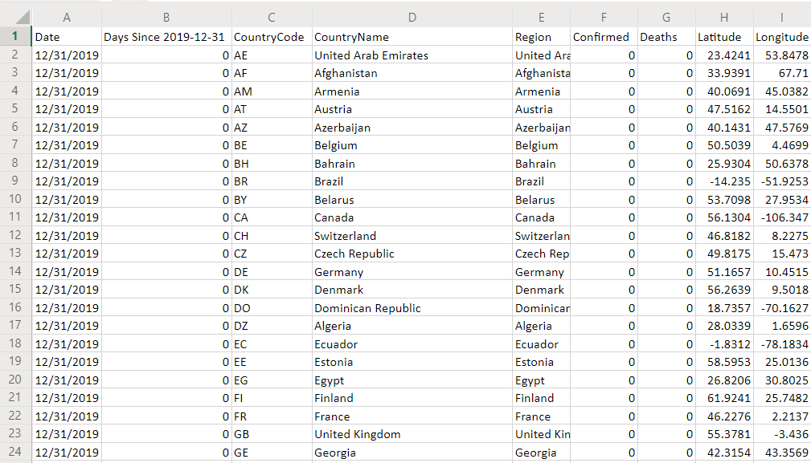
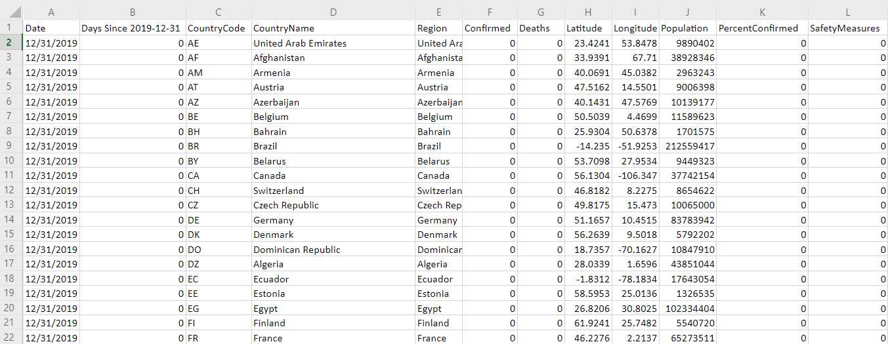

# COVID-19 Live Data Pipeline

### Understanding Repo Contents
* Helper Data
  - Contains helper data for the program 'COVID19_data_pipeline.py.' 
  - Helper data found in the folder includes data pertaining to country populations, country region names, number of available hospital beds in each region, county names for each US state, and latitudes and longitudes for each location.
* Output Data
  - Contains all data that is output as a result of running 'COVID19_data_pipeline.py' and 'add_safety_measures.py.'
  - complete_df.csv/json
    * Data frame with columns for Date, Days Since 12/31/2019 (date of first recorded case), Country Code, Country Name, Region, Confirmed, Deaths, Latitude, and Longitude.
  - complete_df_safety_measures.csv/json
    * Data frame with same columns as complete_df.csv/json in addition to columns for Population, Percent Confirmed (Confrimed divided by Population), and Safety Measures (changes from 0 to 1 when the Percent Confirmed column becomes greater than or equal to 0.002% of population. This column is meant to estimate the date in which each location began implimenting stay-at-home orders)
* COVID19_data_pipeline.py
  - Program that generates the complete_df.csv/json files. Scrapes COVID-19 data from WHO, ECDC, MSCBS, dxy.cn, https://covidtracking.com/api/, github.com/BlankerL, and  https://github.com/open-covid-19.
* add_safety_measures.py
  - Adds the columns Population, Percent Confirmed, and Safety Measures onto the data frames generated by COVID19_data_pipeline.py.
  - Populations for each region are imported from the 'Helper Data' folder.
  - Information regarding population for each region was downloaded from https://github.com/open-covid-19, with missing values filled in using various sources on Google.

### Prerequisites
* Download all data in the 'Helper Data' folder and edit the program so that the import statements are pointing to wherever this folder is located on your device.
* Create an 'Output Data' folder on your device that all the data can be saved to.

### Libraries to Install
* pandas
* httplib2
* bs4
* datetime
* re
* requests

## Running the Programs
* First, open the COVID19_data_pipeline.py program, change all directories so that they point to the proper locations on your machine, then run the entire program. Once run, 'complete_df.csv/json' will be saved into your 'Output Data' folder.
  - NOTE: If you are running the program for the first time, you will have to navigate to Part 8 and un-comment this section. Once you have run the program once and you have verified that 'complete_df.csv/json' were saved into your 'Output Data' folder, then you can comment out this section again. You do not need to re-execute Part 8 the next time that you run the program due to the fact that the program will use the previously downloaded 'complete_df.csv/json' as its basis, adding any updated data onto these dataframes. 
* Next, open the add_safety_measures.py program, change all the directories so that they point to the proper locations on your machine, then run the entrie program. Once run, 'complete_df_safety_measures.csv/json' will be saved into your 'Ouput Data' folder.
  - NOTE: The program will attempt to fill in all region populations using the data located in the 'Helper Data' folder. However, if there are any locations that do not already have their populations saved within the 'Helper Data' folder, these locations will be printed out, and you will need to manually search Google and add these populations into the appropriate .csv files within Helper Data.

### Data Frame Screenshots

##### complete_df

##### complete_df_safety_measures

### Final Thoughts
* As of now, the pipeline was manually run at 9:00 a.m. and 9:00 p.m. each day. In future versions, the programs could be set up to run automatically each day.
* One time consuming aspect of the pipeline was checking for locations that had missing populations. In 'Helper Data', the populations for all locations were saved into a .csv file. However, with each new day, novel locations saw cases of COVID-19, so 'Helper Data' did not contain the populations for these areas, and the populations had to be manually added into the helper .csv files. In future versions, the program could be configured so that when a population is missing, it automatically scrapes the internet and fills in the population automatically
* One final change that could be made would be including region/state data for more countries. As of now, region/state data was only included for five countries: US, China, Spain, Italy, and Australia.

## Authors

* **William Schmidt** - [LikedIn](https://www.linkedin.com/in/william-schmidt-152431168/)

## Acknowledgments

* Thank you to to https://github.com/open-covid-19 for providing so many reliable websites for data collection!
